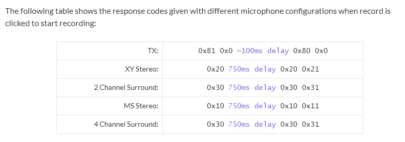
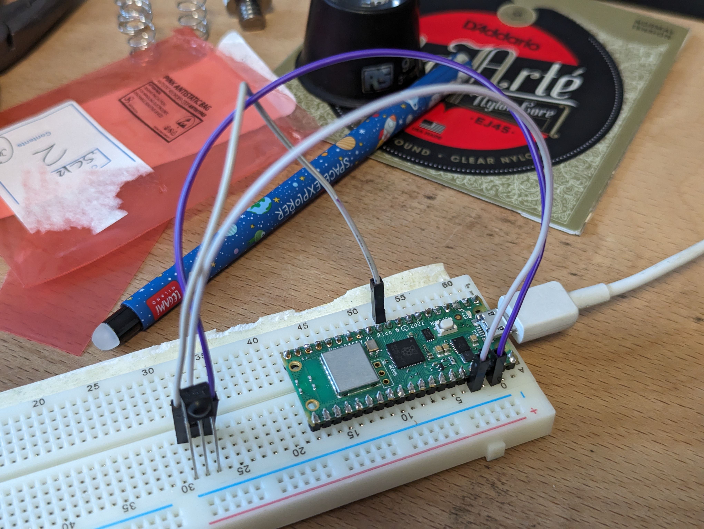
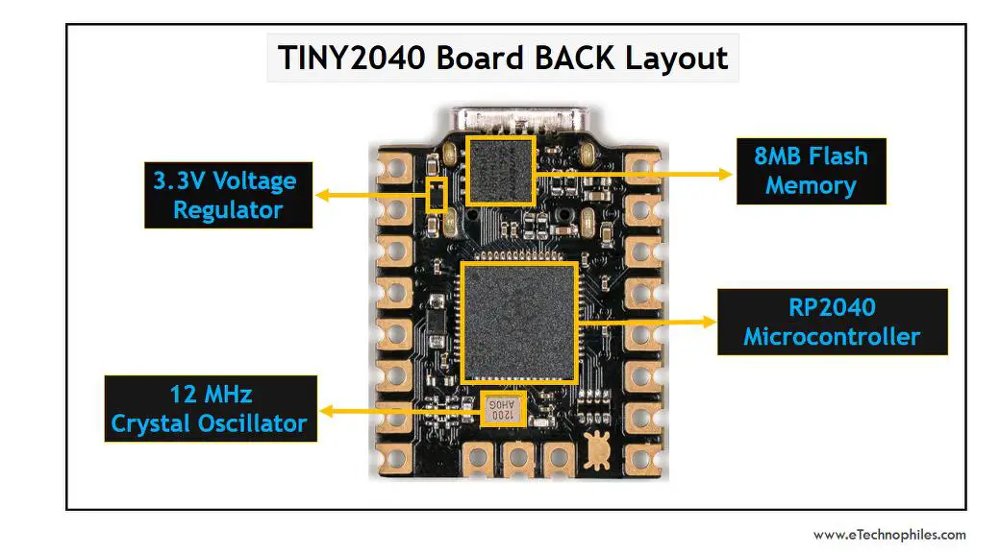
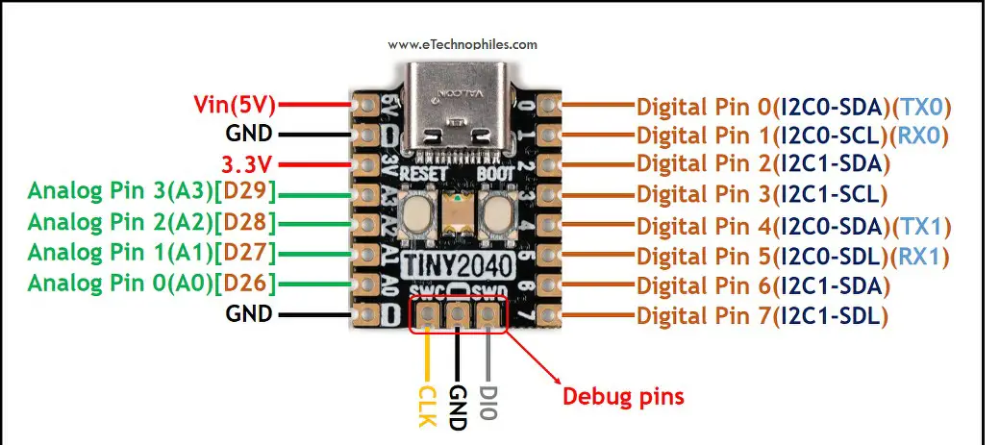
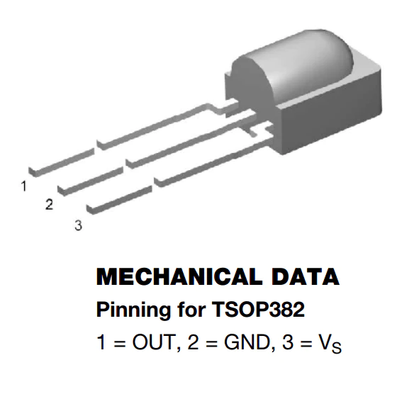
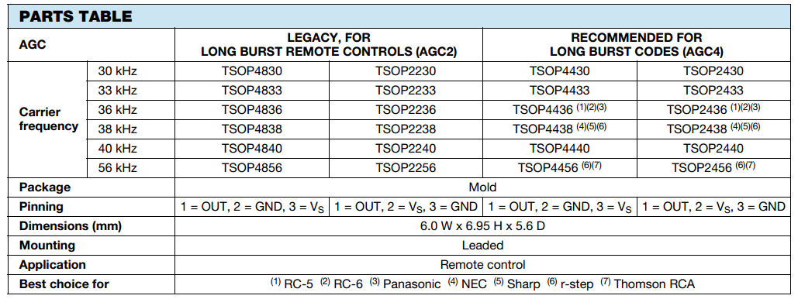
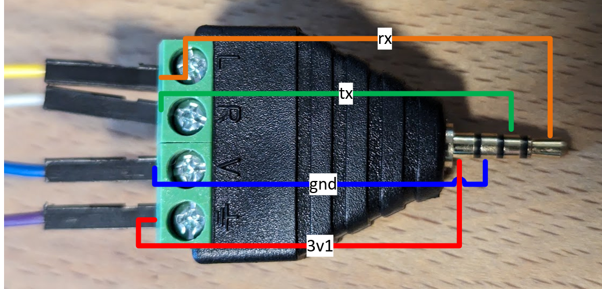
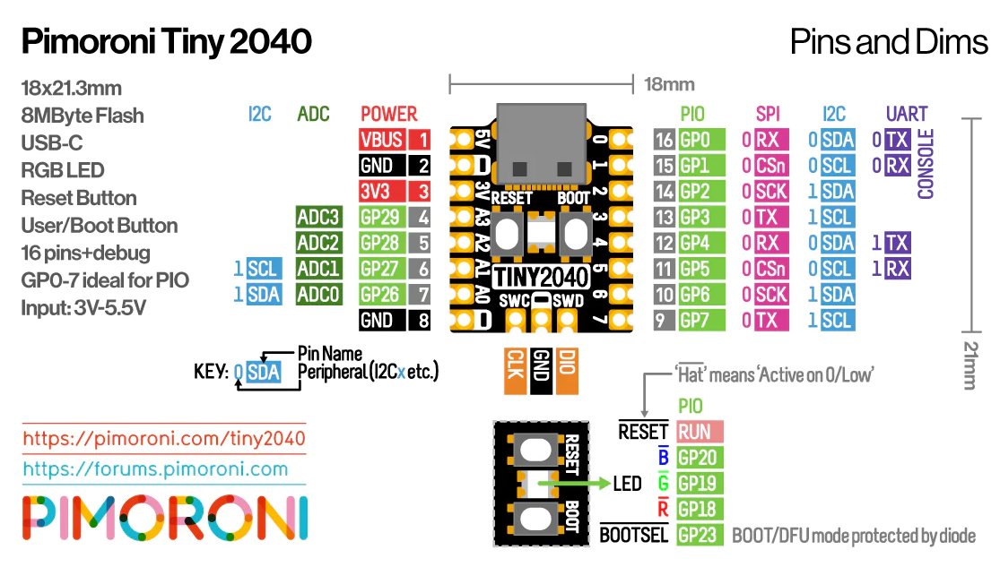

# H2Remote

## 23rd July 2023 ##
Another thread to pick at:
https://github.com/radicalrendell/zoom_remote/blob/master/zoomctl.py

https://www.webwork.co.uk/2021/03/wireless-remote-control-for-zoom-h2n.html
https://github.com/lowfriars/ZoomRemote

With Zoom connected with trrs breakout, L (yellow wire) on the breakout connects to ping GP4 on a pico.
Code in 04_pico_zoom_rx can receive bits
0x81,0x80


## 22nd July 2023 ##

Serial 2400 8b no parity 1 stop (8n1)
Bit order: LSB first, inverted logic: no
https://github.com/raspberrypi/pico-examples/blob/master/pio/uart_rx/uart_rx.pio

"With no activity on the recorder the RX and TX pins show ~2.7 volts"

"When you press the record button on the remote, after a moment the recording LED lights up"

"On the oscilloscope I can see three different square wave patterns for the three different buttons on the TX pin and a single type of square wave
on RX to light the LED."

"The following images show the signal for the record button then that sent in
response to to light the LED.

 Signal sent by the remote when Record pressed

 Signal sent by the Zoom recorder to light the LED in the remote



Can I get the first byte of the response? 0x20

Using teensy example code:
```
// incoming data
Serial2.begin(2400, SERIAL_8N1);  // Remote Receive - RX
Serial3.begin(2400, SERIAL_8N1);  // Remote Transmit - TX
```

https://arduino-pico.readthedocs.io/en/latest/piouart.html

```
Equivalent to the Arduino SoftwareSerial library, an emulated UART using one or two PIO state machines is included in the Arduino-Pico core. This allows for up to 4 bidirectional or up to 8 unidirectional serial ports to be run from the RP2040 without requiring additional CPU resources.

Instantiate a SerialPIO(txpin, rxpin, fifosize) object in your sketch and then use it the same as any other serial port. Even, odd, and no parity modes are supported, as well as data sizes from 5- to 8-bits. Fifosize, if not specified, defaults to 32 bytes.
```

https://learn.adafruit.com/intro-to-rp2040-pio-with-circuitpython?view=all


## 21st July 2023 ##

My TSOP2238 IR diodes arrived today.
These have a different leg ordering to the standard pins I use.



Pin 1 (left when facing) - purple wire to GND
Pin 2 - white wire to 3v3
Pin 3 grey wire to GP07 (working with test script 01_pico_IR_PIO)

This works great, so I can plan to solder it on to the Tiny_2040

## 18th July 2023 ##

Serial 2400 8b no parity 1 stop (8n1)
Bit order: LSB first, inverted logic: no
https://github.com/raspberrypi/pico-examples/blob/master/pio/uart_rx/uart_rx.pio

// bytes to start and stop the recorder, a negative number is used as a delay
int record[5] = { 0x81, 0x0, -100, 0x80, 0x0 };  


# 17th July 2023 ##

Tiny 2040 from Pimoroni is compatible with firmware designed for the Raspberry Pi Pico.

It is one-third of the size of a Raspberry Pi Pico & has 16 GPIO pins while Raspberry Pi Pico has 40 pins.

With proper orientations & mapping of the pins, there is no loss of functionality despite lesser pins.

Board has some unique features that Raspberry Pi Pico does not have, such as a dedicated reset button, a fourth ADC pin, RGB LED & USB C port.



Pin numbers 
Pin numbers are available on top of the board. 
These are numbered as logically &, these relate to GPIO pin number as per the Pico pinout reference.

Tiny 2040 Pinout
Pinout of the Tiny 2040 shows that it has a total of 16 pins(3 additional pins are for debugging) out of which 12 are I/O pins: 8 digital, 4 analog(12 bit).



The remaining pins are 2X Ground, 1X 5V, and 1X 3.3V. Board supports 2X UART(UART0 and UART1), 1X SPI, and 2X I2C(I2C0 and I2C1) interfaces.

I have been using GP22 (pin 12) on the pico.

I can try and use D0
Or I could try to use D26 (A0) in the tiny, which would be 

I programmed up the Tiny 2048 with the code in 01_pico_IR.
It didn't work because the Tiny doesn't have board.GP22 defined.

I made a copy of the code in 03_tiny2034, including the libraries, and changed the default pin to 7.

It was a bit iffy holding the wires on, but I got the tiny to recognize codes.

Perfect!


IR - Infrared Receiver (TSOP38238)
To use, connect pin 3 (all the way to the right) to 5V power, pin 2 (middle) to ground and listen on pin 1. It doesn't do any decoding of the signal, just passes the 'raw data' along.



I was puzzling this evening about the layout of my board. Because the gnd pin is in the middle, there was no neat way to pop the part into three adjacent pins on the tiny.

I couldn't figure out why the internet didn't have 100s of tips about how to swap the order of legs, how to bend them around, or shim boards that let you change the order.
I even considered making one.



Then I learned this - and it's a bit of a revelation.
The TSOP4838 is the same part as the TSOP2238 - except they have different pinning!

I can get OUT,VS,GND - which backwards is GND/VS/OUT - which is the order of the pins I want to use.


## 16th July 2023 ## 

Started work on a shock-mount for the H2.
This will also give me a frame on which to mount the remote?

Time to start on the remote. Some parts have arrived - 2.5mm jacks. TRRS.

Pin one being the tip of the 2.5mm jack plug:
1. Remote Receive – RX
2. Remote Transmit – TX
3. Ground
4. 3.1V – Power



VBUS



Pico PIO IR decoding:
https://github.com/rdear4/Pico_PIO_IR_Receiver

Let's start for something basic with the IR reading.
https://learn.adafruit.com/ir-sensor/using-an-ir-sensor

Connected up a KY-022 Infrared sensor module to pico WH

Gnd, 3v3 and GP1 (pin 2)

Adafruit CircuitPython IRRemote library on your CircuitPython board.

Flashed on on adafruit-circuitpython-raspberry_pi_pico-en_US-7.3.3.uf2

Copied on lib adafruit_irremote.mpy

Using the code in 00_pico_IR_test, I could identify an IR pulse using my samsung TV remote.
Sensor seems happy running at 3v3

Setup rdear4's pio library. Added adafruit_pioasm.mpy.
Changed module input to pin gp22 (pin 29)

It can read volume codes from my remote.
11100000111000001110000000011111
11100000111000001110000000011111
11100000111000001101000000101111

It can register, but not recognise my Nikon remote.

It can recognise and understand my Edifer remote.
It can recognise and understand my son's cheap LED light remote.

Now I need to write my own PIO programs based on this to detect signals from the H2?


### Tiny 20240 ###
Getting started...
https://www.instructables.com/Introducing-the-Tiny-2040-Microcontroller-IR-Commu/
This even shows a receive IR example!

Plugged in to USB C. Powered, but did not detect. Changed cable. Appeared are rp2.

There is different firmware for the 2mb and 8mb versions! I have the 8mb version.

Copied on adafruit-circuitpython-pimoroni_tiny2040-en_GB-7.3.3.uf2 (not latest, but I used 7.3.3 on picos)


## 14th July 2023 ##

timelapse/timelapse/timelapse

https://www.tomshardware.com/how-to/use-raspberry-pi-camera-with-bullseye

```The latest Raspberry Pi OS is based upon Debian 11 (Bullseye) and with this new release we see the familiar raspistill and raspicam camera commands replaced with a new suite of open source tools dedicated to getting the most from all of the official Raspberry Pi cameras.

Libcamera is a support library for Linux, Android and ChromeOS which was introduced to the Raspberry Pi via a previous Raspberry Pi OS, but it has come into the spotlight due to the changes made for Bullseye. The app offers an easy to use series of tools which can tweak many different camera settings (aperture, color balance, exposure) via a series of switches issued when the command is invoked.``````

Done some very cool things with a raspberry pi 3.
Remote development, touch screen. camera. 3D printed supports.
Setup for time lapse - I think.


## 10th July 2023 ##

Resurrecting a gemma board to run circuit python.

Not sure if my gemma is an M0

https://learn.adafruit.com/adafruit-gemma-m0/circuitpython

Plugged in and turned on.

Double pressed reset. Waiting and button went green.

I studied a project a while ago about reading IR code using PIO.
https://github.com/raspberrypi/pico-examples/tree/master/pio/ir_nec

I didn't use it at the time, but it might be a great starting point for the H2 code generation.

https://github.com/carolinedunn/timelapse/blob/master/README.md

