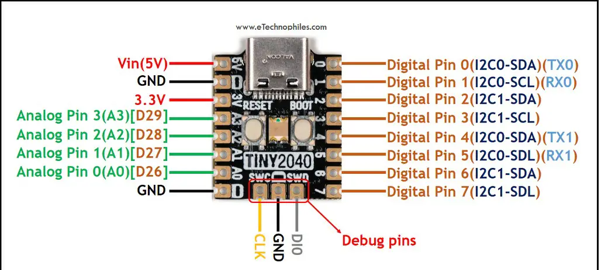
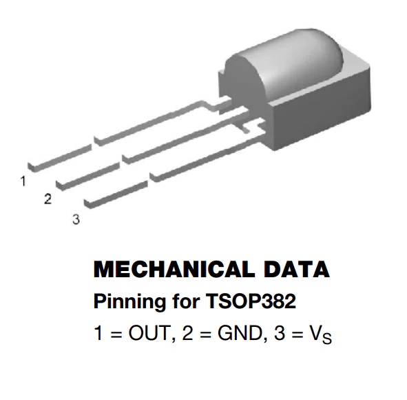

Let's recap what I am doing.

I have this mid-range zoom h2 microphone.

[ b roll video of microphone ]

I use it for recording some solo pieces, but really I bought it for recording at the community and school orchestras I help at.

It has an microphone array, which is good for capturing ambient sounds, like a full orchestra - but the best place to position it is generally right at the front of the audience, or with the conductor.
As such - it's not very convenient to start and stop recording. I can't really walk out from the string section between songs to physically press the button.

In the past, I've generally just pressed record before the concert starts, paused it for the interval and stopped it at after the concert has finished. But that's pretty annoying too.

I could ask the conductor to do it - but generally they have other things on their mind - like greeting conducting the orchestra.

What it needs is a remote control - and in fact is has a 2.5mm jack port on the side for a remote control. It's a four wire interface, for serial communication with a protocol - so not just an sp/sf switch.

And this is the official remote control. It has a big red button, to start/stop recording and shows a red LED when recording and a flashing LED when the recording is paused.

But for some maddening reason the stock remote control is wired! 

So I'd need to trail meters of cables between the orchestra and the conductor's stand for that to be any use.

I was a bit surprised there wasn't a wireless remote available - but I found a few other enterprising hackers online who had set out on similar paths. Including resources for reverse-engineering the serial protocol of the remote.

Let's talk about my initial plan - and then my current plan.

My initial plan was for a parasitic wireless transceiver.

I wanted this tiny 2040 micro controller

With a tsop IR reciever

 to listen for button presses from an IR remote control.

And the Tiny 2040 would be wired to a 2.5mm jack, and able to plug-in to, communicate with and control recording on the H2.

In this approach, the IR remote would have its coin cell battery, the but Tiny 2040 based transceiver would be powered from the 3 volts available on the 2.5mm jack - ultimately powered from the 2x AA batteries in the H2.

The tiny 2024 doesn't have mounting holes - but the USB C connector doesn't need to be used when its in operation, so I plan to use a Male breakout to form a mechanical connection between the board and a 3d printed housing.

Now, if you've seen my previous video - you'll have seen me doing an experiment to find out what the current draw was for the tiny 2040, to check I could power it.

Anyway - turns out I made a mistake.

DSC_4575.MOV
When I press the tac button, tiny 2040 is drawing power from the 2AA batteries, with the multi-meter in series.
Doing this, the Tiny 2040 draw 25mA - which makes sense because when I look at the data sheet for the RP2040 chip - that idles as 20mA.

Importantly, this is an order of magnitude off from the measurements I took before.

I wasn't previously worried about the power supply - but now it warrants further analysis.

DSC_4574.MOV
Circuit which shows current draw.
H2 is providing power now from 2.5mm jack.
Tac switch is pressed to complete circuit. 
LED is powered, with a B5k potentiometer providing variable current limiting.
The multi-meter is in series to show the current in the circuit.

As I dial down the resistance provided by the potentiometer, the LED glows slightly brighter.

DSC_4576.MOV
Very short showing that max current draw (zero resistance) cannot draw more than 10mA from the H2.

So - I cannot power an RP2040 chip from the limited current coming out of the H2.

I can't build a parasitically powered device - so now I need a plan that involves a powered transceiver, batteries and on-off switches.

There is plenty of power in the H2 - but it's the current limit on the remote port that's the problem.

The 2 AA batteries have up to 4800 mA hours.

The capacity of a CR2032 coin cell battery is typically around 225mAh
This would run the tiny for about 10 hours.

And then there are small rechargeable li-po batteries which typically have 150mAh - 500mAh depending on size.
This would run the tiny for about between 6 20 hours.

I pondered this for a couple of days, undecided between two approaches.

So I'm going to try them both.

I'd prefer to use a lipo rechargeable battery. But to do that I need to make some concessions on size.
Even small lipos are quite big - at least compared to the tiny. The smallest I have in stock is a 150mAh, which is still bigger than the tiny.
Plus since its rechargable, I will also need to add a way to charge it.
Using an external lipo charger really means having a JST socket to connect/disconnect the battery from the tiny
And since it's power is no longer controlled by the H2, I will also need to add an on-off switch.
Because the Tiny is so bare-bones, it doesn't have a JST socket, battery charging support, or an enable pin. I can add these from a lipo shim, but the shim is as big as the tiny.

A more sensible option here might be to move away from the tiny 2040, and to use something like an adafruit 2040 feather. Although it has a bigger footprint, the lipo charging, management and on/off are all supported on board - I just need to break out the USB C port for charging - which is pretty convenient.
As you can see from the picture, where things are approximately to scale, the feather on the right is certainly larger than the tiny and the shim together.

Video of measurment of current draw for the feature.

Checking the current draw for the feather, it has very similar 26mAh draw - still needs its own power, but will run for just as long as the tiny on the lipo battery.

So that is one option I am building out.

Another option that might allow me to stick to tiny is to use a disposable coin cell battery.
A CR2023 in an enclose with a switch is a similar size to the lipo, but could used directly with the tiny 2040. I wouldn't need to add a recharging port or another on/off switch.

Plus it should run to 10 hours of a single coin cell.

I think this is also a good option, so I'm going to prototype this too.